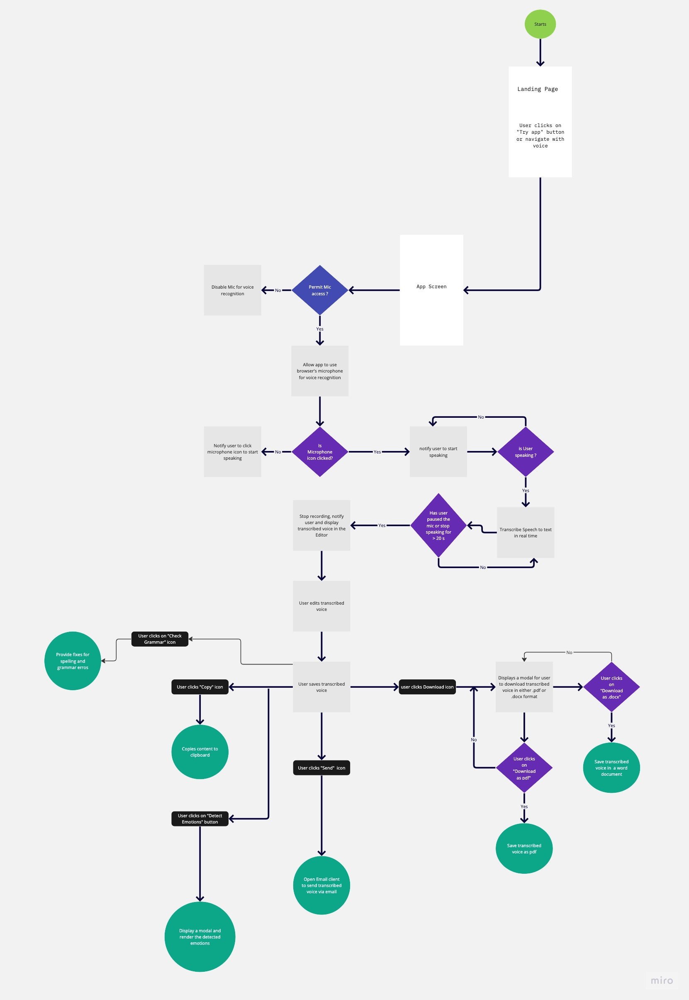

# Introduction

Chirrpy is a voice-recognition app that empowers users to convert their voice to text in real time with emphasis on accessibility, productivity, and accuracy.

## Why a voice recogntion app

A 2017 study by the World Wide Web Consortium (W3C) found that approximately 20% of the world's population has some **form of disability that could impact their ability to use a keyboard.** Of this group, approximately 10% are estimated to have significant difficulties using a keyboard.

**This voice recognition app will provide accessbility to those with disablities**. For instance, users with chronic conditions such as carpal tunnel syndrome can prevent the repetitive stresses that comes with typing by using their voice.

It will also improve the productivity of note-takers, journalist and busy professionals to use their voice to create high quality document which is 3x faster than typing

### Use Cases

- Empower people with mobility impairment to communicate more easily]
- Record and transcribe meeting proceedings
- Increase productivity of writers

### Features

- Topic detection
- Spelling and grammar checker
- Sentiment analysis
- Download transcribed text as pdf of word document
- Edit transcribed text
- Voice navigation

### Services

- Voice recognition: React speech recognition
- Text Editor: Quill / Draftjs / Lexical
- Sentiment Analysis API : Assembly Ai / Emotion analysis API
- Grammar and spellings : Grammarly React SDK
- CI / CD : Netlify
- Storage : Local storage

### Flow chart

    
